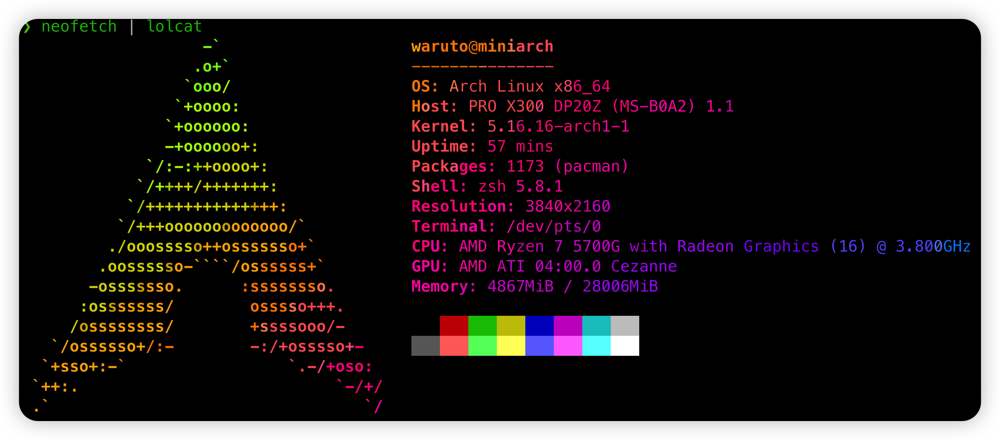
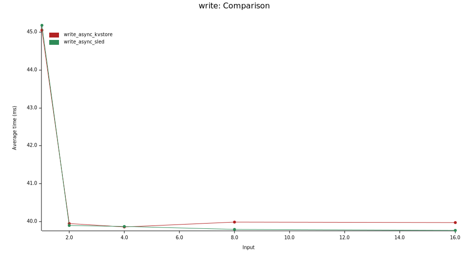
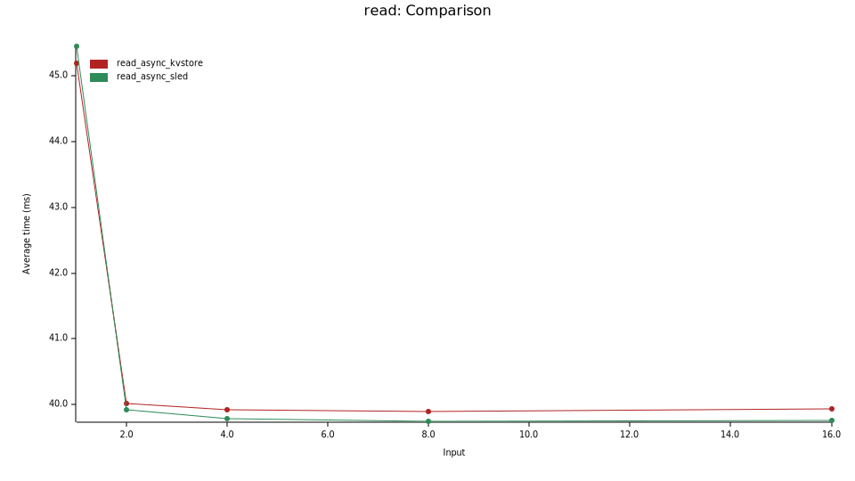

# PingCAP TP 201: Practical Networked Applications in Rust

完成 PingCAP TP 201: Practical Networked Applications in Rust 课程作业

## Project1

project1 构建了一个简单的命令行 k/v store 程序，使用`clap`解析命令行参数(使用`/src/bin/cli.yaml`作为 clap 配置文件)，能够正确解析`set`, `get`, `rm`命令。使用标准库的`HashMap`作为 in-memory 存储。

在做 building blocks1 时，发现`clap` repo 里的一些`example`已经无法正常运行，查看 API 文档解决。

## Project2

project2 实现了一个基于`BItcask`算法的 k/v store 程序。

关键数据结构`KvStore`如下：

```rust
pub struct KvStore {
    log_dir: PathBuf,
    writer: CursorBufferWriter<File>,
    readers: HashMap<u64, CursorBufferReader<File>>,
    file_id: u64,
    index: BTreeMap<String, IndexEntry>,
    inactive_data: u64,
}
```

`readers`是一个保存着当前所有 activate log file 的`reader`的哈希表，用于读取数据。保有对 log file 的 handle，以免每次读取数据都要重新打开文件。

`writer`是当前 log file 的`writer`。

`file_id`是当前 log file 的 id。

`index`保存所有现存的 key 对应的 value 在 log file 的位置，为了容纳大量的索引，并且具有稳定的查找时间，所以使用`BTreeMap`；`IndexEntry`结构保存了数据所在 log file 的 id，offset，数据长度。

`inactive_data`表示 log file 中无用的数据大小，即被被删除的 key，被重设的 key 的数据。

因为`serde_json`不会对读写操作做缓存，并推荐用户使用缓存，所以利用标准库中`BufWriter`和`BufReader`实现的带 Cursor 的`CursorBufferWriter`及`CursorBufferReader`。

每次`KvStore`被启动，将创建新的 log file，其序号单调递增。

如果存在旧的 log file，则依次创建对应的 reader，插入`readers`，并从其中反序列化命令，并在`index`上执行。

当执行 set 时，使用`serde_json`将 set 命令序列化到 log file，随后将新的`IndexEntry`插入 index，如果该 key 是被重设，则更新旧的`IndexEntry`，并更新`inactive_data`。

当执行 get 时，先在`index`中查找 key 是否存在，如存在，则取出`IndexEntry`，并根据其获取对应的`reader`，从 log file 读取出值。

当执行 remove 操作时，如果`index`中有对应 key，则将 rm 命令序列化到 log file 中，并从`index`中删除对应记录以及更新`inactive_data`。

在 KvStore 实例运行过程中，每次 set，remove 执行操作后，`inactive_data`增大，当其超过设定阈值时，对 log file 进行压缩，其方法为：创建新的 log file，遍历`index`中的`IndexEntry`，获得对应`reader`，以将数据复制到新的 log file，然后移除无用的`reader`。

此外，还设定了单个 log file 的最大 size，当 log file 超出该值，则创建新的 log file，以写入后续日志。

## Project3

基于 project2，project3 构建了一个使用`std::net`标准库实现的 k/v store server 和 client。该项目命令行参数更复杂，所以使用了 API 更为简化易用的`structopt`来解析命令行参数。

定义了如下的消息传递格式：

```rust
#[derive(Debug, Serialize, Deserialize)]
pub enum Request {
    Set { key: String, value: String },
    Get { key: String },
    Rm { key: String },
}
/// Enum represents `Response` send from k/v server to client
#[derive(Debug, Serialize, Deserialize)]
pub enum Response {
    Err(String),
    Ok(Option<String>),
}
```

server 数据结构如下：

```rust
/// A `KvsServer`
pub struct KvsServer<E>
where
    E: KvsEngine,
{
    engine: E,
}

pub fn start<A>(&mut self, addr: A) -> Result<()>
where
A: ToSocketAddrs,
{
  let listener = TcpListener::bind(addr)?;
  for stream in listener.incoming() {
    match stream {
      Err(err) => {
        error!("Accept failed {}", err);
      }
      Ok(stream) => {
        self.handle(stream)?;
      }
    }
  }

  Ok(())
}
```

为了抽象，存储引擎作为 server 的泛型参数，其可以为 project2 中的`KvStore`或者是 project3 中包装的`sled`引擎。`start`方法在一个`SocketAddr`上监听，依次处理每一个请求。

client 如下：

```rust
pub struct KvsClient {
    sender: BufWriter<TcpStream>,
    // because the from_reader method needs input stream end
    // so receiver is not a simple BufReader
    // https://docs.serde.rs/serde_json/fn.from_reader.html
    receiver: Deserializer<IoRead<BufReader<TcpStream>>>,
}
```

创建与 server 的连接后，对`TcpStream`进行 clone，包装成`sender`与`receiver`进行请求的发送与结构的接收。

此外，使用了`criterion`和`cargo-criterion`进行 benchmark 测试。

测试环境如下：



可见自己实现的`KvStore`在写入性能上大幅优于`sled`，这可能是由于 sled 的每次`flush`操作比较耗时。


在读取操作上，则是`sled`大幅度优于自己实现的`KvStore`，应该是由于 sled 在内存中保存了数据，而`KvStore`每次都要从文件中读取。


## Project4

project4 中实现了线程池，并以此为基础实现了多线程服务的 k/v store server。

自己实现的`SharedQueueThreadPool`与[rust book](https://doc.rust-lang.org/book/ch20-03-graceful-shutdown-and-cleanup.html)中的实现相似。

支持多线程的`KvStore`如下：

```rust
struct LogReader {
    index: Arc<SkipMap<String, IndexEntry>>,
    file_id_bar: Arc<atomic::AtomicU64>,
    log_dir: PathBuf,
    // need interior mutability of refcell
    readers: RefCell<HashMap<u64, CursorBufferReader<File>>>,
}
struct LogWriter {
    reader: LogReader,
    writer: CursorBufferWriter<File>,
    file_id: u64,
    index: Arc<SkipMap<String, IndexEntry>>,
    inactive_data: u64,
    log_dir: PathBuf,
}
#[derive(Clone)]
pub struct KvStore {
    log_dir: PathBuf,
    reader: LogReader,
    writer: Arc<Mutex<LogWriter>>,
}
```

根据 project4 中的指引，将 KvStore 拆分为 Writer，Reader，Writer 需要加锁，Reader 不需要。

一开始，使用`RWLock`对索引加锁，代码中频繁加锁很麻烦，性能很差，之后，将索引从之前的`BTreeMap`改为`crossbeam`提供的 lock-free 的`SkipMap`。

按照指引进行了 benchmark 测试，测试平台如 project3，结果如下：

写入测试结果如下，随着server 线程池线程数量增加，写入耗时逐渐减少。


读取测试的结果与写入测试类似。线程数少时，sled引擎表现最好，线程多时，三者相当。


# Project5

使用tokio实现的简单异步版本。

写入测试结果如下图，当线程在2以上时，写入速度没有明显改善，且慢于同步版本。可能是因为实现的比较简单，大部分还是阻塞的io操作，另外bench设计也有一定问题，同步和异步两种bench发压的方式也不同。




读取测试结果如下图，与写入测试相似。




